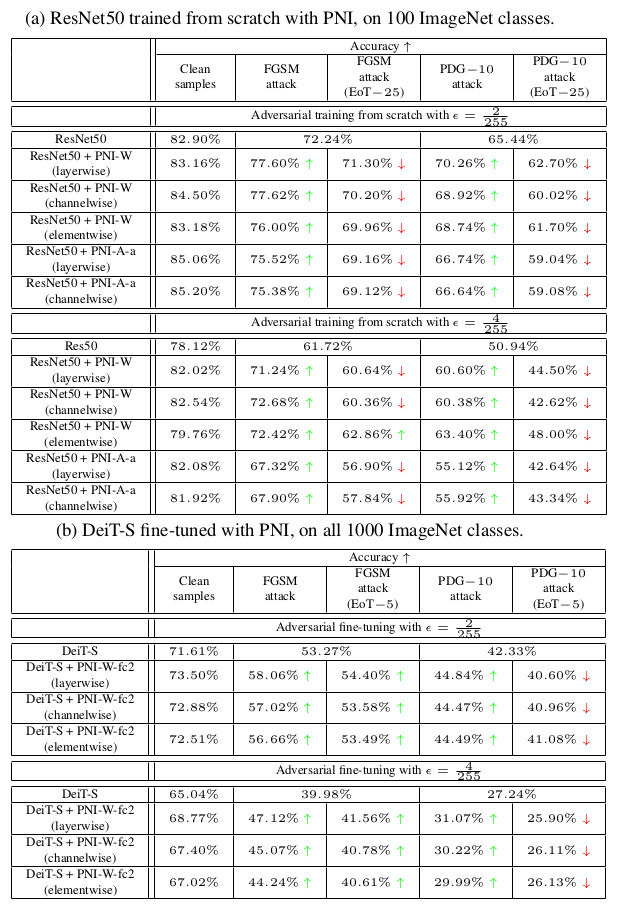

# Gradient Obfuscation Checklist Test Gives a False Sense of Security

This repository implements ideas discussed in the CVPR2022 workshop oral paper ["Nikola Popovic, Danda Pani Paudel, Thomas Probst, Luc Van Gool - Gradient Obfuscation Checklist Test Gives a False Sense of Security"](https://arxiv.org/abs/2206.01705).


# Abstract
One popular group of defense techniques against adversarial attacks is based on injecting stochastic noise into the network. The main source of robustness of such stochastic defenses however is often due to the obfuscation of the gradients, offering a false sense of security.
Since most of the popular adversarial attacks are optimization-based, obfuscated gradients reduce their attacking ability, while the model is still susceptible to stronger or specifically tailored adversarial attacks.
Recently, five characteristics have been identified, which are commonly observed when the improvement in robustness is mainly caused by gradient obfuscation.
It has since become a trend to use these five characteristics as a sufficient test, to determine whether or not gradient obfuscation is the main source of robustness.
However, these characteristics do not perfectly characterize all existing cases of gradient obfuscation, and therefore can not serve as a basis for a conclusive test.
In this work, we present a counterexample, showing this test is not sufficient for concluding that gradient obfuscation is not the main cause of improvements in robustness.

# Five characteristics checklist
The five common characteristics of gradient obfuscation, as observed by [A. Athalye et al. - Obfuscated gradients give a false sense of security: Circumventing defenses to adversarial examples.] 
1. One-step attacks performs better than iterative attacks.
as
2. Black-box attacks are better than white-box attacks.
3. Unbounded attacks do not reach 100% success.
4. Random sampling finds adversarial examples.
5. Increasing the adversarial distortion bound does not increase success.

# Requirements
This project is implemented using Python3 and the PyTorch Deep Learning framework. Following frameworks and libraries are used:

* python 3.8.5
* pytorch 1.7.1+cu110
* torchvision 0.8.2+cu110
* numpy 1.19.2
* pyyaml 5.4.1
* wandb 0.12.3

The code has only been used and tested on the Linux OS, but it should work on other OSs as well.

# Data set
For conducting experiments, this project uses the ILSVRC-2012 ImageNet dataset, containing 1.2M training and 50000 validation images grouped into 1000 classes. For instructions on how to download and preprocess the dataset, take a look at the script provided at `/imnet_preparation/1k_regular_cls/extract_ImageNet.sh`. Finally, the directory structure should look like this:

```
root
 ├──train/
 │    ├── n01440764
 │    │   ├── n01440764_10026.JPEG
 │    │   ├── n01440764_10027.JPEG
 │    │   ├── ......
 │    ├── ......
 ├──val/
 │    ├── n01440764
 │    │   ├── ILSVRC2012_val_00000293.JPEG
 │    │   ├── ILSVRC2012_val_00002138.JPEG
 │    │   ├── ......
 │    ├── ......
```

The core experiments are actually implemented on a 100 randomly sampled classes of the full ImageNet dataset. A script which copies 100 selected classes into a new dataset partition can be found at `/imnet_preparation/100_rnd_cls/copy_100_rnd_cls.sh`. The script uses an list of 100 randomly sampled classes which can be found at `/imnet_preparation/100_rnd_cls/100_rnd_cls_list.txt`.

# Code structure
This project is built on top of the very convinient and popular [rwightman/pytorch-image-models](https://github.com/rwightman/pytorch-image-models) library. This library was created by [Ross Wightman](https://github.com/rwightman) for training and evaluation of different models on ImageNet. To be more specific, the starting point was the 0.4.8 version of the library from the following [snapshot](https://github.com/rwightman/pytorch-image-models/tree/072155951104230c2b5f3bbfb31acc694ee2fa0a).


The script `/train_robust.py` implements a variant of efficient adversarially robust training, which was introduced in the paper [[E. Wong et al. - Fast is better than free: Revisiting adversarial training]](https://arxiv.org/abs/2206.01705).

The script `/validate_robust.py` implements an adversarial evaluation of a trained model. Currently, the implemented attacks are FGSM and PGD, with the posibility of EoT gradient estimation, as well as some other settings.

The script `/validate_regular.py` implements standard classification evaluation.

The directory `/timm/models` contains the implementation of all the models used in this project. 

The directory `/experiment_configs/` contains two `.yaml` config files, with the main settings and hyperparameters for two training modes: training from scratch on 100 classes and fine-tuning on all classes. The directory `/experiment_configs/training_scripts/` contains a Linux bash script for running every experiment from the paper. These scripts call the main training script with one of the config files as an argument, as well as with all the specific hyperparameters as arguments which overwrite the config file entries. The directory `/experiment_configs/evluation_scripts/` contains a Linux bash script for running every evaluation from the paper. 

# Training instructions
To train a specific model, call one of the scripts from `/experiment_configs/training_scripts/`. For example:

```bash
./experiment_configs/training_scripts/resnet50_PNI_W/channelwise_eps2.sh
```

Prior to that, unspecified directories in the script(`CODE_ROOT_DIR`, `DATA_SET_ROOT_DIR` and `OUTPUT_ROOT_DIR`) need to be specified.

# Evaluation instructions
To evaluate a specific model, call one of the scripts from `/experiment_configs/evaluation_scripts/`. For example:

```bash
./experiment_configs/evaluation_scripts/resnet50_PNI_W/channelwise_eps2.sh
```

Prior to that, unspecified directories in the script(`CODE_ROOT_DIR`, `DATA_SET_ROOT_DIR` and `CHECKPOINT_FILE_PATH`) need to be specified.

# Results
Main results can be found in the tables below. Please look at the [paper](https://arxiv.org/abs/2206.01705) for more details.


# Citation
If you use this code, please consider citing the following paper:
```
@inproceedings{Popovic22ChecklistTest,
    title = {Gradient Obfuscation Checklist Test Gives a False Sense of Security},
    author    = {Popovic, Nikola and
                   Paudel, Danda Pani and
                   Probst, Thomas and
                   Van Gool, Luc},
    year = {2022},
    booktitle = {2022 {IEEE} Conference on Computer Vision and Pattern Recognition, {CVPR} 2022},
    series = {The Art of Robustness Workshop: Devil and Angel in Adversarial Machine Learning},
}
```